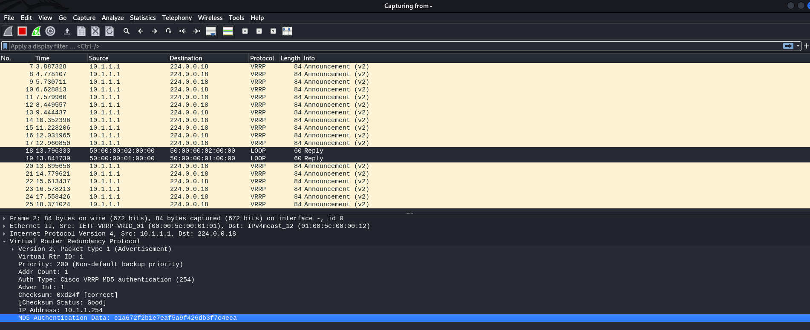
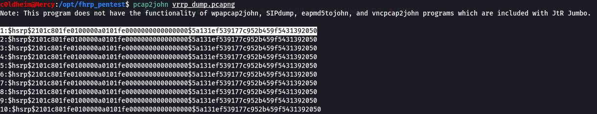
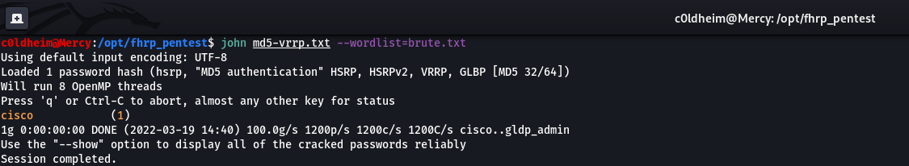

# FHRPMD5Crack
**How to manually crack the MD5 hash password of FHRP protocols.**

**The author has nothing to do with those who will use this tool for personal purposes to destroy other people's computer networks. The tools are presented for training purposes to help engineers improve the security of their network.**

**ᛝ**

## 1. Traffic Dump

**In this scenario, I will analyze an example on the VRRP protocol.** I also want to say that this method **will work with other protocols** of the **FHRP**. **HSRP, GLBP and etc.**

You can open **Wireshark** and capture the traffic. Save it to a **pcapng** file.




## 2. Extracting hashes using pcap2john

With this utility, we can extract MD5 hashes from the traffic dump. The problem is that the protocols of the FHRP class use a different type of MD5 hash. Just copy the MD5 value from Wireshark and try to crack it - it will not work.

```
pcap2john vrrp_dump.pcapng
```



```
cat >> md5-vrrp.txt
$hsrp$2101c801fe0100000a0101fe0000000000000000$5a131ef539177c952b459f5431392050
```

## 3. Cracking MD5 hashes with John

Using **John**, we pass a file with hashes and a dictionary to the input. **(brute-force attack)**

```
john md5-vrrp.txt --wordlist=brute.txt
```



**Cracked password from the VRRP domain - cisco**

